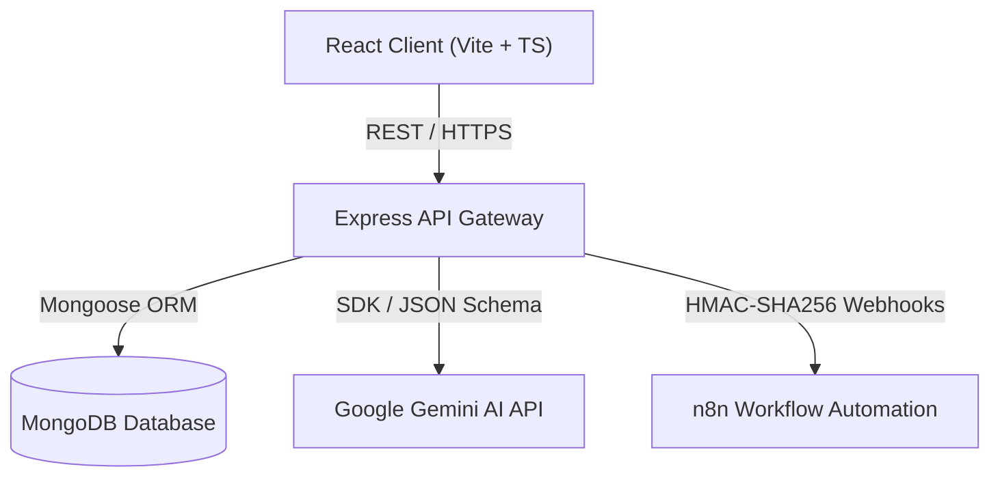

# BrandPulse AI - Enterprise Architecture Blueprint 🏛️

This document outlines the end-to-end Enterprise Architecture for **BrandPulse AI**, an AI-powered Brand Monitoring and Sentiment Analysis platform.

---

## 1. System Architecture Overview 🌐

BrandPulse AI utilizes a decoupled, modern multi-container architecture. It partitions key concerns into isolated components that communicate via standard interfaces.



---

## 2. Frontend Architecture 💻

The frontend is built using **React (v19)** with **Vite** and **TypeScript** to provide a fast, static-optimized client container with strict type safety.

### 2.1 State & Session Management
- **Stateless/Session Flow**: Component and custom hook states coordinate views and manage auth tokens.
- **API Services Client**: Axios wrapper ([frontend/src/services/api.ts](file:///C:/Users/modle/OneDrive/Desktop/BrandPulse-AI/frontend/src/services/api.ts)) with request/response interceptors handles authorization token injection and handles `401 Unauthorized` token expiry globally.

### 2.2 Styling System (Tailwind CSS)
- **Glassmorphism Theme**: Uses semi-transparent glass panels with backdrop filters (`backdrop-blur-md`), dynamic borders, and deep gradients to generate a premium dark aesthetic.
- **Design Tokens**: Configured custom color tokens (`slate-950` base, `primary-500` accents) and slow micro-animations inside [tailwind.config.js](file:///C:/Users/modle/OneDrive/Desktop/BrandPulse-AI/frontend/tailwind.config.js).

---

## 3. Backend Architecture ⚙️

The backend is built with **Node.js** and **Express** using ES Modules. It separates routes, controllers, middleware, services, and models.

```text
Request ──> [Rate Limiter] ──> [Helmet Headers] ──> [JWT Auth] ──> [Routes]
                                                                     │
                                                                     ▼
[Response] <── [Global Error Handler] <── [Mongoose] <── [Controller] <── [Gemini Service]
```

### 3.1 Folder Structure Layout
- **config/**: Configures database and logger instances.
- **controllers/**: Express HTTP controllers.
- **middleware/**: Security, authentication, and error interceptors.
- **models/**: Mongoose database schemas.
- **routes/**: API routers.
- **services/**: Business operations and third-party integrations (Gemini, Webhooks).
- **utils/**: Utility code.

---

## 4. MongoDB Database Architecture 🗄️

The database is built on MongoDB using Mongoose.

- **Development Mode**: Run as a single container instance mapped to port `27017` with standard volumes.
- **Production Scaling**: Prepared for Replica Set configuration to enable transactions and Change Stream change data capture (CDC) for webhook sync workers.
- **Schema Relationship**:
  - `User` has many `Brands`.
  - `Brand` has many `Mentions`.
- **Indexing**:
  - `users`: `{ email: 1 }` (unique).
  - `mentions`: `{ brand: 1, publishedAt: -1 }` (compound query index), and `{ sentiment: 1 }` (metrics indexing).

---

## 5. Authentication Architecture 🔑

- **JWT Tokens**: Stateless JWT tokens are stored in the browser's `LocalStorage` and passed via the `Authorization: Bearer <TOKEN>` header.
- **Pass Hash**: Passwords are encrypted on register/update using `bcryptjs` with a cost factor of 10.
- **Expiration**: Standard token lifecycle is 7 days.

---

## 6. AI & Sentiment Architecture 🧠

- **Engine**: Google Gemini 1.5 Flash API.
- **Prompting Strategy**: Rigid prompt constraint returning standard JSON matching:
  ```typescript
  interface AIResponse {
    sentiment: 'positive' | 'neutral' | 'negative';
    sentimentScore: number; // -1.0 to 1.0
    keyThemes: string[];
    emotionalTone: string;
    suggestedAction: string;
    explanation: string;
  }
  ```
- **Fallback Engine**: Keyword scoring algorithm acts as a local fallback if Gemini is offline or fails, preventing system failures.

---

## 7. n8n & Webhook Integration Architecture 🔀

To enable external notifications and CRM actions, BrandPulse AI dispatches secure webhooks to n8n workflow triggers.

### 7.1 Webhook Authentication: HMAC-SHA256
To prevent webhook spoofing, all outbound webhook requests include security headers verifying payload integrity:

- **Secret Key**: Stored in backend environment as `N8N_WEBHOOK_SECRET`.
- **Verification Header**: Outbound HTTP requests contain the header `X-BrandPulse-Signature`.
- **Signature Construction**:
  ```javascript
  const signature = crypto
    .createHmac('sha256', process.env.N8N_WEBHOOK_SECRET)
    .update(JSON.stringify(payload))
    .digest('hex');
  ```
- **n8n Verification**: The receiving n8n webhook node verifies that the computed signature matching the payload and secret aligns with `X-BrandPulse-Signature`.

---

## 8. API Architecture 🔌

RESTful standard routing prefixed with `/api`.

| Route | Method | Access | Description |
| :--- | :--- | :--- | :--- |
| `/api/auth/register` | `POST` | Public | Register new developer account |
| `/api/auth/login` | `POST` | Public | Authenticate and obtain JWT |
| `/api/auth/profile` | `GET` | Private | Retrieve current user profile |
| `/api/brands` | `POST` | Private | Register new monitored brand |
| `/api/brands` | `GET` | Private | List all monitored brands |
| `/api/brands/:id` | `DELETE` | Private | Remove brand and its mentions |
| `/api/mentions/brand/:brandId` | `GET` | Private | Fetch paginated mentions feed |
| `/api/mentions/brand/:brandId` | `POST` | Private | Manually log review & trigger AI |
| `/api/mentions/brand/:brandId/sync` | `POST` | Private | Simulates background crawling |
| `/api/mentions/brand/:brandId/metrics` | `GET` | Private | Fetch timeline/source chart metrics |

---

## 9. Code Standards & Naming Conventions 📏

- **Variables & Functions**: `camelCase` (e.g. `syncBrandMentions`).
- **React Components / Mongoose Models**: `PascalCase` (e.g. `App.tsx`, `User.js`).
- **Files & Folders**: `camelCase` (e.g. `authController.js`, `errorHandler.js`).
- **Constants**: `UPPER_CASE` (e.g. `process.env.MONGODB_URI`).
- **Code Style**: Strictly checked by ESLint and styled by Prettier on save.
- **Global Error Handling**: Managed via centralized `errorHandler.js` Express middleware.
- **System Logging**: Managed via Winston logger, exporting to `logs/all.log` and `logs/error.log` while rendering console logs.
